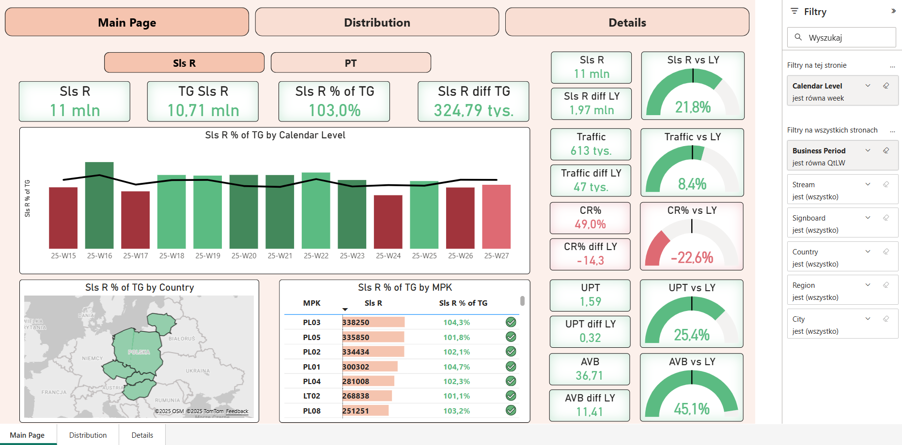

## KPI Store Dashboard
(English Below)

Raport pokazuje kluczowe wskaźniki sprzedaży takie jak: sprzedaż i PT w odniesieniu do celu oraz zeszłego roku, liczba wejść, konwersja, liczba sztuk na paragon, średni koszyk.  
Został zbudowany w Power BI z wykorzystaniem DAX i dynamicznych parametrów.

### Podgląd raportu
#### 1. KPI Store Main Page
   
Zakładka „Main Page” stanowi główną stronę raportu, prezentującą kluczowe wskaźniki efektywności sprzedaży w ujęciu tygodniowym lub miesięcznym(sterowane za pomocą parametru Calendar Level), geograficznym i operacyjnym. Została zaprojektowana z myślą o szybkiej ocenie wyników względem targetów oraz porównaniu z analogicznym okresem roku poprzedniego.

#####  Główne elementy:
- **KPI Boxy** z wartościami:
  - Sprzedaż (Sls R), Target (TG Sls R), % realizacji
  - Różnice względem targetu i roku poprzedniego (LY)
- **Wskaźniki YOY** w formie gauge’ów i KPI Boxów:
  - Intuicyjna ocena dynamiki zmian dla poszczególnych KPI
- **Wykres słupkowy**:
  - Realizacja targetu sprzedaży w ujęciu tygodniowym/miesięcznym
- **Mapa**:
  - Realizacja targetu sprzedaży według kraju
  - Szczegółowe informacje dostępne w tooltipach
- **Tabela MPK**:
  - Szczegółowe wyniki jednostek operacyjnych (MPK) z % realizacji
- **Panel filtrów**:
  - Dynamiczne sterowanie widokiem: Calendar Level, okres biznesowy, kraj, miasto, stream

#### 2. KPI Store Distribution

Zakładka „Distribution” przedstawia rozkład kluczowych wskaźników efektywności w ujęciu lokalizacyjnym za pomocą parametru Location Level(Store, City, Signoboard,Stream).  
Pozwala zidentyfikować jednostki o najwyższej i najniższej dynamice względem roku poprzedniego oraz targetów.

##### Główne elementy:

- **Rozkład KPI vs LY**:
  - Liczba poziomów lokalizacji z lepszą relizacją niż w zeszłym roku dla takich miar jak: Sprzedaż, Traffic, Jednostki Sprzedaży (Sls U), Conversion Rate (CR%)
  - Kolorystyka: czerwony (spadek), zielony (wzrost)
- **Scatter plot**:
  - Oś X: `Measure X`
  - Oś Y: `Measure Y`
  - Miary do Wyboru dla Measures: Sls R vs TG, Pt vs TG, Traffic vs LY, AVB vs LY, UPT vs LY
  - Punkty wybierane dla Location Level (np. PL52 Woj)
  - Kolorowanie warunkowe: Gdy obie Measures są pozytywne, to zielony, inaczej czerwony
- **Panel filtrów**:
  - Poziom lokalizacji, Okres biznesowy, Kraj, Miasto, Stream

#### 3. KPI Store – Details

Zakładka „Details” prezentuje szczegółowe dane operacyjne dla każdej jednostki lokalizacyjnej (MPK).  
Zawiera pełen zestaw wskaźników efektywności, umożliwiając granularną analizę wyników sprzedażowych i konwersji.

##### Główne elementy:
- **Tabela Location Level** z KPI:
  - Sprzedaż (Sls R), % realizacji targetu, różnice vs LY
  - PT i jego realizacja względem targetu
  - Traffic, Sls U, UPT, AVB, CR — wszystkie w ujęciu YOY
- **Kolorystyka wartości**:
  - Wykresy oraz ikony, które mają za zadanie ułatwić identyfikację pozytywnych i negatywnych trendów
- **Wiersz podsumowujący**:
  - Łączne wartości dla wszystkich MPK — ocena całościowa
- **Panel filtrów**:
  - Dynamiczne sterowanie widokiem: okres biznesowy, poziom lokalizacji, kraj, miasto, stream

### Plik raportu
[`kpi_store.pbix`](reports/kpi_store.pbix)# PowerBi-portfolio
